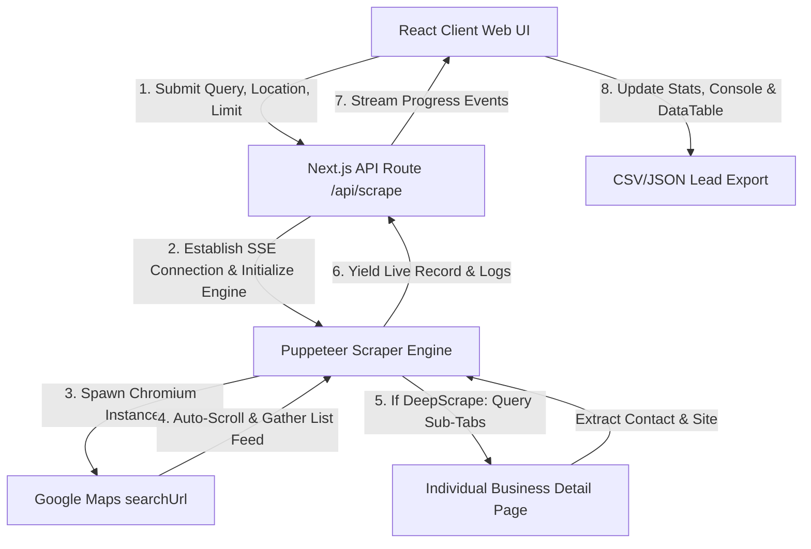

# 📍 MapperScrape 🚀

[](https://nextjs.org/)
[](https://react.dev/)
[](https://pptr.dev/)
[](https://opensource.org/licenses/MIT)
[](https://jestjs.io/)

**MapperScrape** is an ultra-premium, full-stack, real-time Google Maps scraping application built with **Next.js 16 (React 19)**, **Puppeteer**, **Tailwind CSS**, and **Server-Sent Events (SSE)**. It delivers a fast, fluid, and robust extraction workflow for acquiring rich business leads (emails, phone numbers, websites, ratings, reviews, and addresses) directly from Google Maps.

---

## 📖 Table of Contents
- [✨ Key Features](#-key-features)
- [🏗️ System Architecture](#️-system-architecture)
- [🚀 Quick Start & Installation](#-quick-start--installation)
- [🖥️ UI Dashboard Tour](#️-ui-dashboard-tour)
- [⚙️ How the Scraper Engine Works](#️-how-the-scraper-engine-works)
- [🧪 Testing & Quality Assurance](#-testing--quality-assurance)
- [🤝 Contributing](#-contributing)
- [📜 License](#-license)

---

## ✨ Key Features

*   **⚡ Real-Time SSE Streaming:** Watch data load live. Uses Server-Sent Events to stream scraped records and terminal activity directly from the Puppeteer node backend to your frontend layout seamlessly.
*   **🕷️ Puppeteer Scraper Engine:** Features smart automated scrolling, dynamic item matching, direct redirection detection, and reliable DOM parsing to circumvent modern layout mutations.
*   **🔍 Deep Scraping Support:** Toggle deep-scrape to launch background Puppeteer tabs that query individual business details, successfully fetching contact numbers and corporate websites.
*   **🛡️ Anti-Bot Protection:** Implements rotating modern browser user-agents and localized language headers to ensure requests resemble organic navigation.
*   **📊 Premium Interactive Dashboard:** Sleek, futuristic dark-mode UI with statistical charts, analytical cards, responsive data grid, and multi-threaded filters.
*   **💾 Multi-Format Exporters:** Export your extracted B2B leads instantly as fully structured **CSV** or **JSON** files with one-click buttons.
*   **🛡️ SOLID & Well-Tested:** Built on clean OOP principles, TypeScript type safety, and comes fully backed by a **Jest** suite validating parsing and client-side logic.

---

## 🏗️ System Architecture

MapperScrape is built with a highly decoulped unidirectional pipeline that ensures maximum interface reactivity:



---

## 🚀 Quick Start & Installation

### Prerequisites
- [Node.js](https://nodejs.org/) (v20+ recommended)
- [npm](https://www.npmjs.com/) or [yarn](https://yarnpkg.com/)

### 1. Clone the Repository
```bash
git clone https://github.com/Raman0925/GoogleMap-Scrapping-Application.git
cd GoogleMap-Scrapping-Application
```

### 2. Install Dependencies
```bash
npm install
```
*Note: This will automatically download the Chromium browser compatible with Puppeteer.*

### 3. Start Development Server
```bash
npm run dev
```

Now, navigate to [http://localhost:3000](http://localhost:3000) in your web browser to access the dashboard!

---

## 🖥️ UI Dashboard Tour

```
┌──────────────────────────────────────────────────────────┐
│                      MAPPER SCRAPE                       │
├─────────────┬────────────────────────────────────────────┤
│             │  [ Total ]  [ Avg Rating ]  [ Website % ]  │
│  CONTROLS   ├────────────────────────────────────────────┤
│  Query: [ ] │  >_ LIVE CONSOLE (Real-time engine logs)   │
│  Loc:   [ ] │     [INFO] Launching Puppeteer...          │
│  Limit: 20  │     [SUCCESS] Scraped: "Joe's Cafe"        │
│             ├────────────────────────────────────────────┤
│  [START]    │  DATA GRID (CSV / JSON Exports Available)   │
│  [STOP]     │  Search Filter: [               ]          │
│             │  Name        │ Rating │ Phone       │ Site  │
└─────────────┴──────────────┴────────┴─────────────┴───────┘
```

1.  **Sidebar Panel:** Configure keywords, targets, scraping quotas, and toggle the deep scrape function. Features clean live action triggers.
2.  **Performance Metrics Panel:** Dynamic metrics displaying total records, average business ratings, and percentages of leads containing valid contact numbers or active websites.
3.  **Engine Console Terminal:** Streams color-coded debugging messages and progress events directly from Puppeteer.
4.  **Extracted Leads Grid:** Full-featured grid table providing multi-column sorting (name, rating, category), real-time quick search filtering, and robust CSV/JSON download bridges.

---

## ⚙️ How the Scraper Engine Works

The scraping process is executed under `src/lib/scraper/engine.ts` using three distinct phases:

1.  **Search & Navigation:** Launces a sandboxed Puppeteer browser browser context, spoofs User-Agents, sets high timeout thresholds, and navigates to target query pages.
2.  **Smart Scroller:** Runs an internal scrolling routine inside Google Map's `role="feed"` container. It automatically stops scrolling when the target limit is reached, or when the scrolling reaches the end of results list.
3.  **Safe Details Parser:** Inspects individual CSS classes and aria-labels using a robust fallback chain (extracts ratings, categories, websites, telephone codes). In case of deep-scraping, it spawns standalone tabs to traverse page overlays cleanly.

---

## 🧪 Testing & Quality Assurance

MapperScrape includes a comprehensive Jest test suite that verifies DOM parser safety and components state integrity.

```bash
# Run unit and integration tests
npm test

# Run tests with test coverage statistics
npm run test:coverage
```

Our testing parameters cover:
- Business DOM Parser fallback patterns (`src/lib/scraper/__tests__/parser.test.ts`)
- Client state transitions in main page interfaces
- Rendering safety of widgets (`Sidebar`, `TerminalConsole`, `DataTable`)

---

## 🤝 Contributing

We welcome community contributions to make MapperScrape the most premium leads extraction tool on the internet! 

To get started, please check our [CONTRIBUTING.md](file:///c:/Users/raman/Downloads/web-scraper/CONTRIBUTING.md) for standard guidelines, code style suggestions, and pull request procedures.

---

## 📜 License

Distributed under the MIT License. See `LICENSE` for more details.

---

<p align="center">
  Made with ❤️ by <a href="https://github.com/Raman0925">Raman0925</a> and contributors.
</p>
